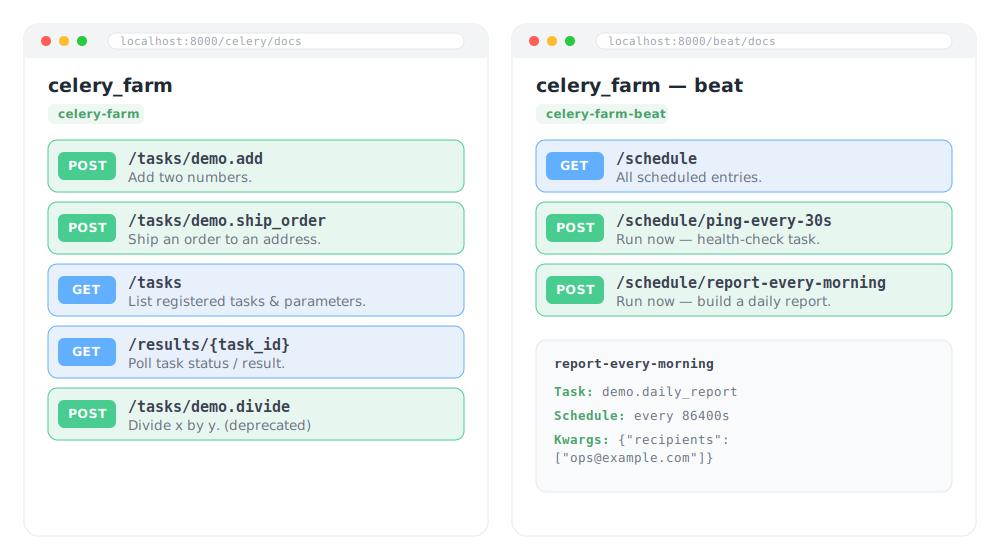

<p align="center">
  
</p>

<p align="center">
  Generate <b>OpenAPI/Swagger docs</b> and <b>REST endpoints</b> for your registered
  Celery tasks &amp; beat schedule.<br>
  Integrates with <b>FastAPI</b>, <b>Django</b>, and <b>Flask</b>.
</p>

<p align="center">
  <a href="https://github.com/milksys/celery-farm/actions/workflows/ci.yml"></a>
  <a href="https://pypi.org/project/celery-farm/"></a>
  
  
  
  <a href="LICENSE"></a>
</p>

<p align="center">
  
</p>

> The preview above is an illustration. To capture real screenshots, run an example
> app (see [Run the examples](#run-the-examples)), open `/celery/docs` and `/beat/docs`,
> and drop the PNGs into `docs/assets/` (replacing these references).

## Installation

```bash
# pip
pip install celery-farm              # core only
pip install "celery-farm[fastapi]"   # or [django] / [flask]

# uv
uv add celery-farm
uv add "celery-farm[fastapi]"        # or [django] / [flask]
```

The framework integration is an optional **extra** — install the one you use
(`fastapi`, `django`, or `flask`). The core (`build_openapi`, task introspection)
needs only `celery` + `pydantic`.

## Overview

Every integration exposes the same routes:

- `POST /tasks/{name}` — queue a task, returns its `task_id`.
- `GET /tasks` — list registered tasks, parameters, and return types.
- `GET /results/{task_id}` — poll task status/result.
- `GET /openapi.json` + `GET /docs` — OpenAPI document and Swagger UI (tasks).

The periodic-task **beat schedule lives in its own separate Swagger** (`/beat/docs`),
so the main docs stay focused on task calls — see
[Beat schedule](#beat-schedule-separate-swagger).

Per task you can override OpenAPI fields via the decorator:
`@app.task(summary=..., description=..., tags=[...], deprecated=True, openapi_extra={...})`.
A task with a single object-typed argument (pydantic model / TypedDict /
dataclass / dict) takes that object directly as the request body.

Tasks typed with **PEP 484 type comments** (instead of annotations) are also
supported — celery_farm falls back to parsing `# type:` comments, so the params
are still typed in the schema and validated. See `demo.legacy_mul` in
`examples/fastapi_app/app.py`:

```python
@celery_app.task(name="demo.legacy_mul", tags=["legacy"])
def legacy_mul(x, y):
    # type: (int, int) -> int
    return x * y
```

## Beat schedule (separate Swagger)

The beat schedule is documented in its **own** Swagger UI, separate from the
task-calling docs, with two kinds of endpoint:

- `GET /schedule` — **read-only** index listing every entry (task, cadence, args).
- `POST /schedule/{entry}` — **runs the entry now**: dispatches its task immediately
  with the configured args/kwargs and returns a `task_id` (same shape as
  `POST /tasks/{name}`). Each entry is its own operation, so it shows up in Swagger
  with the task's summary/description.

(The recurring execution itself is still driven by the `celery beat` process — these
endpoints let you inspect the schedule and trigger an entry on demand.) Guard the
POST with `dependencies=` (FastAPI) or your framework's auth as needed.

An entry's summary/description default to the **scheduled task's** own
summary/description, so `create_beat_app(celery_app)` documents the schedule with
no extra config. `beat_meta` is **optional** — use it to override `summary`,
`description`, `tags`, `deprecated`, and `openapi_extra` per entry (mirroring the
`@app.task(...)` decorator); a Celery `beat_schedule` entry can't carry these keys
itself, so they're passed here:

```python
create_beat_app(celery_app, beat_meta={
    "ping-every-30s": {
        "summary": "Liveness ping",
        "description": "Every 30s…",
        "tags": ["health"],        # groups the entry under a "health" section
        "deprecated": True,        # also inherited from the task if it's deprecated
        "openapi_extra": {"externalDocs": {"url": "https://…"}},  # any operation field
    },
})  # get_urlpatterns(...) / create_blueprint(...) accept beat_meta too
```

`summary`/`description`/`deprecated` fall back to the **referenced task's** own
values when not given, so a `@app.task(deprecated=True)` marks its scheduled entry
deprecated automatically.

- **FastAPI** — mount tasks and beat as separate sub-apps:

  ```python
  from celery_farm import create_beat_app, create_task_app

  app.mount("/celery", create_task_app(celery_app))
  app.mount("/beat", create_beat_app(celery_app))
  # tasks:  /celery/docs, POST /celery/tasks/{name}, ...
  # beat:   /beat/docs, GET /beat/schedule, POST /beat/schedule/{entry}, /beat/openapi.json
  ```

- **Django / Flask** — automatic: `get_urlpatterns()` / `create_blueprint()`
  already add `/…/beat/docs` (+ `GET /…/beat/schedule`,
  `POST /…/beat/schedule/{entry}`, and `/…/beat/openapi.json`) alongside the
  main `/…/docs`.

## pydantic v1 / v2

Both are supported (`pydantic>=1.9`). celery_farm detects the installed version
and adapts: it emits OpenAPI **3.1** under pydantic v2 and **3.0** under v1
(matching each version's JSON Schema dialect).

Two version-specific caveats under **pydantic v1**:

- Celery's `@task(pydantic=True)` model reconstruction requires v2. Under v1 a
  model-annotated argument arrives as a plain `dict`.
- The FastAPI integration's v1 support is bounded by FastAPI itself — recent
  FastAPI is v2-only, so pair pydantic v1 with a FastAPI release that still
  supports it (e.g. `fastapi==0.111`). The Django/Flask integrations have no
  such constraint.

One caveat under **pydantic v2 on Python < 3.12**: a task whose argument is a
`TypedDict` must use `typing_extensions.TypedDict` (not `typing.TypedDict`) —
pydantic v2 requires this to build the schema. On Python 3.12+ either works.

All combinations (Python 3.11–3.14 × pydantic v1/v2) are exercised in CI.

## Quickstart (FastAPI)

```python
from celery import Celery
from fastapi import FastAPI
from celery_farm import create_beat_app, create_task_app

celery_app = Celery("demo")

@celery_app.task(name="demo.add")
def add(x: int, y: int) -> int:
    return x + y

app = FastAPI()
# Tasks and beat are each mounted as their own sub-app with isolated Swagger UI.
app.mount("/celery", create_task_app(celery_app))  # /celery/docs, /celery/tasks/{name}
app.mount("/beat", create_beat_app(celery_app))    # /beat/docs, /beat/schedule
```

Both sub-apps get their own native FastAPI Swagger (`/celery/docs`, `/beat/docs`).
`dependencies=` applies FastAPI `Depends` (e.g. auth) to every route:

```python
app.mount("/celery", create_task_app(celery_app, dependencies=[Depends(auth)]))
```

Any other keyword is forwarded to the underlying `FastAPI(...)` (typed via PEP 692
`Unpack`, so common options autocomplete). Disable the docs/schema, or set any app
option:

```python
app.mount("/celery", create_task_app(celery_app, docs_url=None, openapi_url=None))
app.mount("/beat", create_beat_app(celery_app, version="2.0.0"))
```

FastAPI renders Swagger UI natively, so customize the viewer with FastAPI's own
`swagger_ui_parameters=` (the equivalent of Django/Flask's `swagger_ui_options`):

```python
app.mount("/celery", create_task_app(
    celery_app,
    swagger_ui_parameters={"docExpansion": "none", "filter": True},
))
```

To point Swagger assets at a different CDN (the FastAPI counterpart of
`swagger_cdn`), FastAPI has no constructor option — override the `/docs` route with
`fastapi.openapi.docs.get_swagger_ui_html(..., swagger_js_url=..., swagger_css_url=...)`.

## Quickstart (Django)

```python
# urls.py
from django.urls import include, path
from celery_farm.integrations.django import get_urlpatterns
from myproj.celery import app as celery_app

urlpatterns = [
    path("celery/", include(get_urlpatterns(celery_app))),
]
# tasks: /celery/docs  (POST /celery/tasks/{name}, /celery/tasks, /celery/results/{id})
# beat:  /celery/beat/docs  (GET /celery/beat/schedule, POST /celery/beat/schedule/{entry})
```

Pure Django (no DRF). Request bodies are validated with pydantic; the OpenAPI
document is built by `celery_farm.build_openapi` and Swagger UI is loaded from a
CDN. `build_openapi(celery_app)` is also usable standalone to just extract a spec.

## Quickstart (Flask)

```python
from flask import Flask
from celery_farm.integrations.flask import create_blueprint
from myproj.celery import app as celery_app

app = Flask(__name__)
app.register_blueprint(create_blueprint(celery_app), url_prefix="/celery")
# tasks: /celery/docs  (POST /celery/tasks/{name}, /celery/tasks, /celery/results/{id})
# beat:  /celery/beat/docs  (GET /celery/beat/schedule, POST /celery/beat/schedule/{entry})
```

## Customizing Swagger UI (Django / Flask)

The Django/Flask integrations render Swagger UI from a CDN. Two knobs let you
change where the assets load from and how the viewer behaves — both apply to the
task **and** beat docs:

- `swagger_cdn` — base URL for `swagger-ui.css` / `swagger-ui-bundle.js` (pin a
  version, swap to unpkg, or self-host). Defaults to
  `https://cdn.jsdelivr.net/npm/swagger-ui-dist@5`.
- `swagger_ui_options` — a dict merged into the `SwaggerUIBundle({...})` call
  (e.g. `docExpansion`, `filter`, `tryItOutEnabled`, `defaultModelsExpandDepth`).
  Values must be JSON-serializable, so JS-function options are not supported.

```python
# Flask
create_blueprint(
    celery_app,
    swagger_cdn="https://unpkg.com/swagger-ui-dist@5.11.0",
    swagger_ui_options={"docExpansion": "none", "filter": True},
)

# Django
get_urlpatterns(
    celery_app,
    swagger_cdn="https://unpkg.com/swagger-ui-dist@5.11.0",
    swagger_ui_options={"docExpansion": "none", "filter": True},
)
```

The same options are available on the low-level `celery_farm.openapi.swagger_ui_html`
helper (`cdn=` / `swagger_ui_options=`) if you render the page yourself.

> **FastAPI** renders Swagger natively — customize it there with FastAPI's own
> `swagger_ui_parameters=` (and other options) forwarded through `create_task_app` /
> `create_beat_app`.

## Run the examples

```bash
# FastAPI
uv sync --extra fastapi
uv run uvicorn examples.fastapi_app.app:app --reload   # /docs  +  /beat/docs

# Django
uv sync --extra django
PYTHONPATH=. DJANGO_SETTINGS_MODULE=examples.django_app.settings \
    uv run django-admin runserver                      # http://localhost:8000/celery/docs

# Flask
uv sync --extra flask
uv run flask --app examples.flask_app.app run          # http://localhost:5000/celery/docs
```

## Development

```bash
make test        # tests on the current interpreter (pydantic v2)
make test-v1     # current interpreter, pydantic v1 (pinned FastAPI/httpx)
make test-all    # full matrix: Python 3.11–3.14 × pydantic v1/v2 (uv fetches each)
```

CI (`.github/workflows/ci.yml`) runs the same 3.11–3.14 × v1/v2 matrix plus a
pre-commit lint job on every push and PR.

## License

Released under the [MIT License](LICENSE) — © 2026 milksys.
